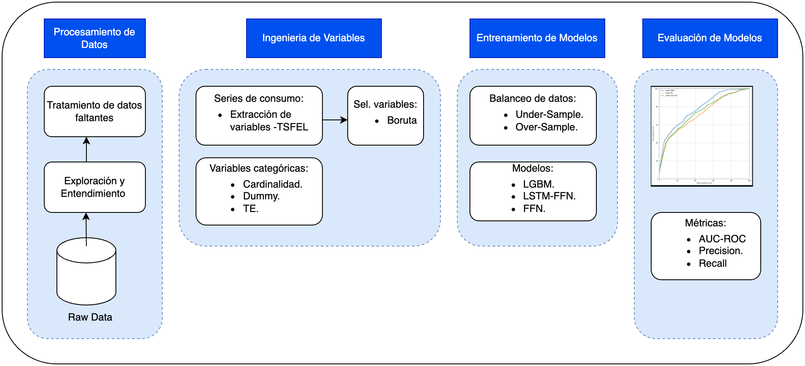

# Energizados

***

Este proyecto presenta un marco de detección de robo eléctrico basado en el aprendizaje automático supervisado utilizando una biblioteca de extracción de variables de series temporales junto con algoritmos de boosting y redes neuronales.

Ver [Notebook Paso a Paso](https://github.com/EL-BID/Energiza2Cod4Dev/blob/master/notebooks/ejecucion_paso_paso.ipynb)

***

## Índice

* [Título](#Título-e-imagen-de-portada)

* [Insignias](#insignias)

* [Índice](#índice)

* [Descripción del proyecto](#descripción-del-proyecto)

* [Demostración](#demostracion-del-proyecto)

* [Tecnologías utilizadas](#tecnologías-utilizadas)

* [Licencia](#licencia)

* [Conclusión](#conclusión)

***

## Descripción del Proyecto
“Energizados” es un proyecto construido para mostrar cómo con el uso de aprendizaje automático se puede ayudar a detectar y disminuir las pérdidas no técnicas reduciendo tiempos de regularización e incrementando la precisión de identificación de fraudes.

El marco de detección de pérdidas no técnicas “Energizados” se puede dividir en 4 grandes etapas. La etapa de preprocesamiento de datos, la etapa de ingeniería de variables, la etapa de entrenamientos de modelo y la etapa de evaluación de modelos.

    

### ***Etapa 1 : Preprocesamiento de datos / Exploración / Entendimiento***

Se requiere de esta etapa para tomar los datos en crudos y darles una estructura de datos significativa. Aquí es importante remarcar que un entendimiento y exploración de datos también es primordial ya que en este paso también se puede decidir que otras variables pueden usarse en el proceso de detección de pérdidas no técnicas. 

En nuestras pruebas, Energizados se evaluó en dos conjuntos de datos proveídos por dos empresas de distribución de energía. Donde se observó que además de las series de consumos mensuales, incorporar variables que describen a los usuarios también ayudan en la detección de usuarios fraudulentos. 

Entre otras cosas que se pueden observar en esta etapa es la proporción de usuario fraudulentos y no fraudulentos. En este tipo de problemas es común tener clases desbalanceadas, por lo general la proporción de usuarios fraudulentos no supera el 10%.

### ***Etapa 2 : Ingenieria de variables***

La ingeniería de variables es el proceso de extracción y selección de las variables más importantes de los datos dados, normalmente se realiza para mejorar la capacidad de aprendizaje del modelo de ML.

Esta etapa puede ser dividida en 2 subtareas, una tarea para la extracción o derivación de nuevas variables y otra tarea para la selección de las variables más importantes.

**Extracción de variables:**

En lo que respecta a los consumos mensuales de usuarios dados, estos datos por si solo carecen de características estadísticas que reflejen adecuadamente los patrones subyacentes en los datos de consumo de los usuaros, haciendo que los modelos de detección de robo de energía sean menos eficientes. 
Por lo tanto se crearon nuevas variables, derivadas de los consumos de energia. Estas variables adicionales pueden ser divididas en 3 tipos: 

- Estadísticas: máximo, promedio, mínimo, mediana, son una muestra de los valores estadísticos calculados; 
- Espectrales derivadas de la serie de consumo: distancia de la señal, pendiente de la señal, varianza de la señal, etc.;
- Temporales: autocorrelación entre las variables, entropía, centroides, entre otros.

En lo que respecta a otras variables que describen a los usuarios, por ejemplo, tipo de tarifa y actividad económica del usuario. De estas se derivaron variables a través de procesamiento clásicos de variables categóricas, entre los cuales se pueden destacar, creacion de variables dummy, reducción de cardinalidad y encoding.

**Selección de variables:**

La selección de variables es el proceso de identificar un subconjunto representativo de variables de un grupo más grande.
En el desarrollo de los modelos, ejecutamos los siguientes pasos:

- Eliminación de variables constantes o con muy baja variabilidad.
- Eliminación de variables altamente correlacionadas entre sí.
- Selección de grupo de variables relevantes para la detección de robo.(Boruta)

### ***Etapa 3 : Entrenamiento de modelos***

En cualquier técnica de aprendizaje automático supervisado, los datos etiquetados se proporcionan inicialmente al clasificador de aprendizaje para su propósito de entrenamiento. Luego, el modelo entrenado se evalúa por su capacidad para predecir y generalizar los datos no etiquetados de manera eficiente.

Como ocurre en la mayoría de los conjuntos de datos de detección de pérdidas no técnicas, estos están desbalanceados. Los datos desbalanceados generalmente se refieren a una situación que enfrentan los problemas de clasificación donde las clases no están representadas por igual.

En lo que respecta a lo que se usó en el siguiente marco de trabajo se utilizaron las  siguientes estrategias:

- Sobremuestreo (oversampling):  Consiste en generar nuevas muestras de la clase que está infrarrepresentadas.
- Sub–muestreo (under sampling): Consiste en eliminar ejemplos o filas de la clase mayoritaria. 

Finalmente, se utilizó la opción ‘under-sampling’, ya que se obtuvieron mejores resultados en la fase de desarrollo.

Para la optimización de hiperparámetros se siguió la estrategia de búsqueda aleatoria (Random Search), la cual consiste en muestrar valores posibles de los hiperparámetros y quedarse con aquellos que, al ser incluidos en el modelo, hayan generado mejores resultados en las métricas.

A continuación se da una breve descripcion de los modelos usuados.

***Light Gradient Boosting Machine (Light GBM)***

El modelo Light Gradient Boosting Machine (LGBM). LGBM, es un modelo dentro del “gradient boosting framework”, ya que usa algoritmos de aprendizaje basados en árboles de decisión.
En particular, LGBM es un modelo de ensamble (combinación de múltiples modelos) dado por el método de boosting. 

Este método comienza ajustando un modelo inicial en los datos y luego construye un segundo modelo que se enfoca en predecir con precisión los casos en los que el primer modelo tiene un desempeño deficiente. Se espera que la combinación de estos dos modelos sea mejor que cualquiera de los modelos por separado. Esta operación se puede hacer de manera sucesiva, construyendo varios modelos que reduzcan el error del anterior.

Algunas características que se destacan en LGBM son la velocidad de entrenamiento (light), la capacidad de manejar grandes volúmenes de datos utilizando poca memoria y el manejo de valores faltantes.

***Red Neuronal***

Las redes neuronales son sistemas de procesamiento de la información cuya estructura y funcionamiento están basados en las redes neuronales biológicas. Estos sistemas están compuestos por elementos simples denominados nodos o neuronas, los cuales se organizan por capas. 

Cada neurona está conectada con otra a partir de unos enlaces denominados conexiones, cada una de las cuales tiene un peso asociado. Estos pesos son valores numéricos modificables y representan la información que será usada por la red para resolver el problema que se presente.

Las conexiones entre las capas tienen un peso o valor asignado, el cual es importante para el aprendizaje de la red.

__Multicapa__

La red neuronal multicapa es una red donde todas las señales van en una misma dirección de neurona en neurona, esto se denomina feedforward.
En lo que respecta a la problemática de detección de fraude, las entradas son las variables con sus respectivos pre-procesamientos descritas en las secciones anteriores y la capa de salida nos da la probabilidad de que un usuario esté cometiendo fraude.

__Concatenación LSTM - Multicapa__

Este es un tipo de red neuronal más compleja que la anterior, en éstas las neuronas presentan conexiones que pueden ir al siguiente nivel de neuronas y a su vez, conexiones que pueden ir al nivel anterior, se denominan conexiones feedforward y feedback.

Es una red neuronal que contiene ciclos internos que realimentan la red, generando así memoria. Dicha memoria le permite a la red aprender y generalizar a lo largo de secuencias de entradas en lugar de patrones individuales.

Se utilizan en problemas donde la secuencia de los datos sí importa, como por ejemplo en problemas de series de tiempo.
En lo que respecta al problema abordado, los consumos de energía mensuales de los usuarios se los puede tratar como una serie de tiempo.

### ***Etapa 4 : Evaluación de modelos***

En cualquier técnica de aprendizaje automático supervisado, los datos etiquetados se proporcionan inicialmente al clasificador de aprendizaje para su propósito de entrenamiento. Luego, el modelo entrenado se evalúa por su capacidad para predecir y generalizar los datos no etiquetados de manera eficiente.
El rendimiento de dichos modelos se evalúa en función de una serie de métricas de evaluación del rendimiento.

En lo que respecta a este proyecto evaluamos en la siguiente métrica.
_Auc-roc_: La curva AUC - ROC es una medida de rendimiento para los problemas de clasificación que tiene en cuenta varios ajustes de umbral. La ROC es una curva de probabilidad y la AUC representa el grado o la medida de separabilidad. Indica en qué medida el modelo es capaz de distinguir entre clases. 

Cuanto más alto sea el AUC, mejor será el modelo para predecir 0s como 0s y 1s como 1s. Por analogía, cuanto mayor sea el AUC, mejor será el modelo para distinguir entre usuarios fraudulentos y aquellos que no lo son.

Esta curva tiene en el eje-y la medida TPR (True Positive Rate) y en el eje-x la medida FPR (False Positive Rate):
- TPR = Recall = TP / (TP+FN)
- FPR = FP / (FP+TN)

## Instrucciones para configurar el ambiente de ejecución.

1. Tener instalada alguna distribución de Python 3.6 o superior.

2. Tener instalado jupyter lab.

3. Descarga/clonar el proyecto de github.

4. Lanzar jupyter lab.

5. Posicionarse en la carpeta del proyecto.

6. Abrir un consola de comando en el entorno de jupyter lab.

7. Instalar los requerimientos utilizando _pip install -r requirements.txt_.

***

## Demostración 

Para hacer un demostración del uso de Energizados, compartimos un conjunto de datos anonimizado. El dataset esta conformado de la siguiente manera.

- __Cantidad de registros__ : 42500
- __Cantidad de columnas__ : 19
- __% de fraudulentos__ : 5.8 %

Descripción de las columnas:

| Variable  | Descripción | Tipo de dato | Cardinalidad |
| :--- | :--- | :--- | :--- |
| Consumo de energía mensual | Indica el comportamiento de consumo a nivel mensual de los usuarios.  Se consideran los últimos 12 consumos.| Numerica | - |
| Actividad | Indica a qué actividad económica se dedica el usuario| Categoría | 284 |
| Tipo de Tarifa | Tarifa que tipo de tarifa se le cobra al usuario| Categoría | 47 |
| Tensión | Tensión instalada al usuario.| Categoría | 18 |
| Material instalacion | Indica tipo de material del medidor instalado| Categoría | 39 |
| Zona | Indica la ubicación geográfica a la que pertenece el usuario | Categoría | 38 |
| Target | Indica si el consumidor es fraudulento o no | Numerica | 0 - 1 |
| Fecha inspección | Indica la fecha en que se inspeccionó al usuario| Fecha | - |

Luego pare ver el codigo del marco de desarrollo funcionando compartimos una notebook donde se puede ir ejecutando paso a paso el proceso. 

Ver [Notebook Paso a Paso](https://github.com/EL-BID/Energiza2Cod4Dev/blob/master/notebooks/ejecucion_paso_paso.ipynb)

***

## Tecnologías utilizadas 

- Python 3.6 o superior
- TensorFlow 2.2
- LGBM 3.3.3
- TSFEL

***

## Licencia 

El siguiente proyecto ha sido financiada por el BID. Ver la siguiente licencia [LICENCIA](https://github.com/EL-BID/Plantilla-de-repositorio/blob/master/LICENSE.md)

***

## Conclusión

Con Energizados se mostró que utilizar un proceso basado en Machine Learning para mitigar el problema de pérdidas no técnicas en la distribución de energía, puede ayudar a automatizar el proceso de detección de fraude obteniendo resultados prometedores promoviendo la digitalización de los procesos de la empresa.

